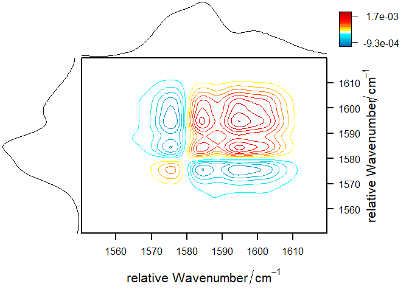

<!-- README.md is generated from README.Rmd. Please edit that file -->
Purpose of corr2D
=================

[](http://cran.r-project.org/package=corr2D)  [](https://travis-ci.org/clacor/corr2D)

The package corr2D implements two-dimensional (2D) correlation analysis in R. It allows the user to calculate and plot homo as well as hetero 2D correlation spectra from an input matrix containing the (preprocessed) spectra. The user can freely choose the reference spectrum used to create the dynamic spectra, how the perturbation vector should be handled, if and how the resulting 2D spectra should be scaled and how many cores should be used to calculate the correlation matrix.
The plot functions offer a wide varity of options to customize the look of 2D spectra. In this context the appearance of the main spectrum can be altered and the 1D reference spectra as well as the colour legend can be controlled.
The package also features an example dataset containing preprocessed FT-Raman spectra of a self-healing polymer sample.

How to use corr2D on a simple example
=====================================

First we need to make the package aviable and get an example dataset. For illustration purposes we use the FuranMale dataset from the present corr2D package.

``` r
library("corr2D")
data(FuranMale, package = "corr2D")
```

As the next step we calculate the homo 2D correlation spectra of the FuranMale dataset using the function corr2d() and the first spectrum of the dataset as reference spectrum.

``` r
twod <- corr2d(FuranMale, Ref1 = FuranMale[1, ], corenumber = 1)
#> HOMO-Correlation: 1 cores used for calculation
#> 12:12:42 - Fast Fourier Transformation and Multiplication 
#>  to obtain a 145 x 145 Correlation-Matrix 
#> 12:12:42 - Done
```

The last step is to plot the resulting 2D correlation spectra. As an example we plot the synchronous correlation spectrum of the FuranMale dataset. The appearance of the 2D plot can be altered by i.e. using the xlab and ylab options to control the labels at the x- and y-axes.

``` r
plot_corr2d(twod, xlab = expression(paste("relative Wavenumber" / cm^-1)),
                  ylab = expression(paste("relative Wavenumber" / cm^-1)))
```


